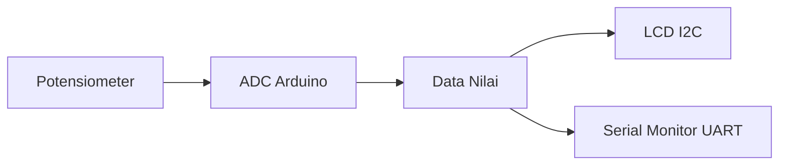

# 📘 Praktikum Sistem Tertanam

# Modul 3 - Protokol Komunikasi (I2C, UART, ADC)

**Praktikum Pemrograman Sistem Tertanam**
**Nama:** Revalina Fidiya Anugrah
**NIM:** H1D023011
**Shift Awal Praktikum:** A
**Shift Akhir Praktikum:** Senin

---

# Deskripsi Percobaan

Pada praktikum ini dilakukan pembacaan nilai analog dari **potensiometer** menggunakan **ADC Arduino**, kemudian hasilnya ditampilkan pada:

* 📟 LCD menggunakan komunikasi **I2C**
* 💻 Serial Monitor menggunakan komunikasi **UART**

---

#  Konfigurasi Rangkaian

## Wiring Komponen

| Komponen      | Pin    | Arduino |
| ------------- | ------ | ------- |
| LCD I2C       | VCC    | 5V      |
| LCD I2C       | GND    | GND     |
| LCD I2C       | SDA    | A4      |
| LCD I2C       | SCL    | A5      |
| Potensiometer | Kiri   | GND     |
| Potensiometer | Tengah | A0      |
| Potensiometer | Kanan  | 5V      |

---

# Diagram Alur Sistem



---

# Jawaban Pertanyaan Praktikum

## 1. Cara Kerja Komunikasi I2C antara Arduino dan LCD

Komunikasi **I2C (Inter-Integrated Circuit)** menggunakan hanya **2 kabel utama**:

* SDA (Data)
* SCL (Clock)

### Mekanisme:

1. Arduino bertindak sebagai **Master**
2. LCD bertindak sebagai **Slave**
3. Arduino mengirim data ke alamat LCD (misalnya `0x27`)
4. Data dikirim melalui jalur SDA dengan sinkronisasi clock dari SCL
5. LCD menerima data dan menampilkannya

### Analogi:

* Arduino = Supir
* LCD = Penumpang
* Alamat I2C = Nomor kursi

Keunggulan:

* Hemat pin (hanya 2 kabel)
* Bisa banyak device dalam satu jalur

---

## 2. Apakah Pin Potensiometer Harus Seperti Itu?

### Jawaban:

**Tidak wajib**, tetapi konfigurasi tersebut adalah standar.

### Penjelasan:

Potensiometer memiliki 3 pin:

* Kiri → GND
* Tengah → Output (ke ADC)
* Kanan → 5V

### Jika pin kiri & kanan tertukar:

* Tegangan output akan **terbalik**
* Saat diputar ke kiri → nilai ADC maksimum
* Saat diputar ke kanan → nilai ADC minimum

Jadi Tidak merusak komponen, hanya membalik arah pembacaan

---

## 3. Program Modifikasi (UART + I2C)

## Kode Program

```cpp
#include <Wire.h>
#include <LiquidCrystal_I2C.h>
#include <Arduino.h>

// Inisialisasi LCD dengan alamat I2C 0x27
LiquidCrystal_I2C lcd(0x27, 16, 2);

// Pin potensiometer
const int pinPot = A0;

void setup() {
  Serial.begin(9600);      // Memulai komunikasi UART
  lcd.init();              // Inisialisasi LCD
  lcd.backlight();         // Menyalakan backlight LCD
}

void loop() {
  int nilai = analogRead(pinPot);  // Membaca ADC (0-1023)

  // Konversi ke tegangan (0-5V)
  float volt = nilai * (5.0 / 1023.0);

  // Konversi ke persen (0-100%)
  int persen = map(nilai, 0, 1023, 0, 100);

  // Mapping ke panjang bar (0-16 karakter)
  int panjangBar = map(nilai, 0, 1023, 0, 16);

  // ================= UART =================
  Serial.print("ADC: ");
  Serial.print(nilai);
  Serial.print(" Volt: ");
  Serial.print(volt, 2);
  Serial.print(" V Persen: ");
  Serial.print(persen);
  Serial.println("%");

  // ================= LCD =================
  lcd.setCursor(0, 0);
  lcd.print("ADC:");
  lcd.print(nilai);
  lcd.print(" ");
  lcd.print(persen);
  lcd.print("%   ");

  lcd.setCursor(0, 1);

  for (int i = 0; i < 16; i++) {
    if (i < panjangBar) {
      lcd.print((char)255); // blok penuh
    } else {
      lcd.print(" ");
    }
  }

  delay(200);
}
```

---

## Penjelasan Kode

### Library

* `Wire.h` → komunikasi I2C
* `LiquidCrystal_I2C.h` → kontrol LCD
* `Arduino.h` → fungsi dasar Arduino

### Setup

* `Serial.begin(9600)` → komunikasi UART
* `lcd.init()` → mulai LCD
* `lcd.backlight()` → nyalakan lampu LCD

### Loop

#### Membaca ADC

```cpp
int nilai = analogRead(pinPot);
```

#### Konversi Tegangan

```cpp
float volt = nilai * (5.0 / 1023.0);
```

#### Konversi Persen

```cpp
int persen = map(nilai, 0, 1023, 0, 100);
```

#### Output Serial

```
ADC: 0 Volt: 0.00 V Persen: 0%
```

#### Output LCD

* Baris 1 → nilai ADC + persen
* Baris 2 → bar grafik

---

# Hasil Pengamatan

## Tabel Data

| ADC | Volt (V) | Persen (%) |
| --- | -------- | ---------- |
| 1   | 0.00 V   | 0%         |
| 21  | 0.10 V   | 2%         |
| 49  | 0.24 V   | 5%         |
| 74  | 0.36 V   | 7%         |
| 96  | 0.47 V   | 9%         |

---

# Visualisasi Grafik

```mermaid
xychart-beta
    title "Hubungan ADC vs Tegangan"
    x-axis [1, 21, 49, 74, 96]
    y-axis "Volt (V)" 0 --> 5
    line [0.00, 0.10, 0.24, 0.36, 0.47]
```

---

# Kesimpulan

Komunikasi **I2C** memungkinkan LCD dikontrol hanya dengan 2 kabel, **UART** digunakan untuk monitoring data melalui Serial Monitor, Potensiometer menghasilkan sinyal analog yang dikonversi oleh ADC, Data dapat ditampilkan ke LCD dan Serial Monitor secara bersamaan dan Sistem berhasil mengintegrasikan ADC, I2C, dan UART dalam satu program.
